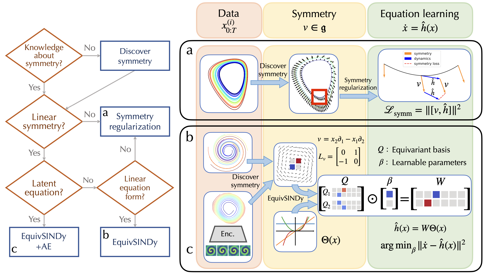

# Symmetry-Informed Governing Equation Discovery

The official codebase for our paper (NeurIPS 2024 Poster), [Symmetry-Informed Governing Equation Discovery](https://arxiv.org/pdf/2405.16756).



## Data preparation

### Option 1: download data
We provide the generated data used in our experiments at [this link](https://drive.google.com/file/d/1Tnrr2xJ_DED0qv-qhwTwnIM1Sf2MHpCY/view?usp=sharing).

Unzip the data and put all the files in the `./data` subdirectory.

### Option 2: generate data
Alternatively, generate the data using the scripts in the `data_utils` directory. This allows for more flexibility in altering the noise scale, number of trajectories, sampling interval, etc. The general format:

```bash
python -m data_utils.${ODE_SYSTEM_NAME} --n_ics ${N_ICS} --num_steps ${N_STEPS} --noise ${NOISE_SCALE} --dt ${DELTA_T} --smoothing ${SMOOTHING_METHOD} --save_dir ${SAVE_DIR} --save_name ${SAVE_NAME}
```
where the arguments stand for:

* `n_ics`: number of trajectories (each with a random initial condition)
* `num_steps`: number of timesteps within each trajectory
* `dt`: time interval between adjacent timesteps
* `smoothing`: smoothing method for noisy data, only `gp` (Gaussian process) or `None` supported currently
* `save_dir`: the directory where the data file is saved
* `save_name`: name for the data file; note that the final name also includes some other configurations

For more details, see the Python scripts in the `data_utils` directory.

Below we provide examples for the ODE systems used in the paper:

* Damped Oscillator

```bash
python -m data_utils.damped_oscillator --n_ics 50 --noise 0.2 --smoothing gp
python -m data_utils.damped_oscillator --n_ics 10 --noise 0.2 --smoothing gp --save_name val
```

* Growth

```bash
python -m data_utils.growth --n_ics 100 --noise 0.05 --smoothing gp
python -m data_utils.growth --n_ics 20 --noise 0.05 --smoothing gp --save_name val
```

* Lotka-Volterra System

```bash
python -m data_utils.lotka --n_ics 200 --noise 0.99 --smoothing gp
python -m data_utils.lotka --n_ics 20 --noise 0.99 --smoothing gp --save_name val
```

* Glycolytic Oscillator

```bash
python -m data_utils.selkov --n_ics 10 --noise 0.2 --smoothing gp
python -m data_utils.selkov --n_ics 2 --noise 0.2 --smoothing gp --save_name val
```

* Reaction-Diffusion: use the script from [SINDy Autoencoder](https://github.com/kpchamp/SindyAutoencoders/tree/master/rd_solver).

## Equation Discovery

### Dependency
For experiments that do not involve genetic programming:
```
wandb==0.14.0
sympy==1.13.0
numpy=1.23.5
pytorch==1.13.1
tqdm==4.64.1
```

For genetic programming, we require additional dependency due to the use of `PySR` package and the need of precomputing the symmetry regularization with some beta PyTorch feature in `torch.func`. Create the conda environment by
```bash
conda env create -f envs/pt_beta.yml
```

Before running, replace the `wandb` project and entity with your information in `main.py`, `main_sindy.py` and `main_wsindy.py`, or simply `export WANDB_MODE=disabled` to disable `wandb` logging.

### Equivariant SINDy for Linear Symmetries (Section 5.1)

* Damped Oscillator
```bash
# EquivSINDy-c (ours)
bash run_scripts/dosc_noise20_esindy.sh
# SINDy
bash run_scripts/dosc_noise20_sindy.sh
# Weak SINDy
bash run_scripts/dosc_noise20_wsindy.sh
# Genetic Programming w/ PySR
python main_pysr.py --config dosc/noise20_pysr.cfg
```

* Growth
```bash
# EquivSINDy-c (ours)
bash run_scripts/growth_noise05_esindy.sh
# SINDy
bash run_scripts/growth_noise05_sindy.sh
# Weak SINDy
bash run_scripts/growth_noise05_wsindy.sh
# Genetic Programming w/ PySR
python main_pysr.py --config growth/noise05_pysr.cfg
```

### Equivariant SINDy in Latent Space (Section 5.2)

First, place the data file `reaction_diffusion.mat` in the data directory `./data`. Then, to simultaneously discover symmetry and an equivariant equation,
```bash
python main.py --config rd/sym_eq.cfg
```

### Symmetry Regularization (Section 5.3)
* Lotka-Volterra System
```bash
# Symmetry Discovery (run this before any equivariant method)
python main.py --config lv/noise99_sym.cfg

# Sparse regression
# SINDy
bash run_scripts/lv_noise99_eq_sindy.sh
# WSINDy
bash run_scripts/lv_noise99_eq_wsindy.sh
# EquivSINDy-r
bash run_scripts/lv_noise99_eq_ireg.sh

# Genetic programming
mkdir pysr_temp
# PySR
python main_pysr.py --config lv/noise99_eq_pysr.cfg
# EquivGP-r (ours)
python main_pysr.py --config lv/noise99_eq_pysr_symm.cfg
```

* Glycolytic Oscillator (Sel'Kov)
```bash
# Symmetry Discovery (run this before any equivariant method)
python main.py --config selkov/noise20_sym.cfg

# Sparse regression
# SINDy
bash run_scripts/selkov_noise20_eq_sindy.sh
# WSINDy
bash run_scripts/selkov_noise20_eq_wsindy.sh
# EquivSINDy-r (ours)
bash run_scripts/selkov_noise20_eq_symreg.sh

# Genetic programming
mkdir pysr_temp
# PySR
python main_pysr.py --config selkov/noise20_eq_pysr.cfg
# EquivGP-r (ours)
python main_pysr.py --config selkov/noise20_eq_pysr_symm.cfg
```

### Evaluation
For sparse-regression-based approaches, we provide an evaluation pipeline to compute the success probability and parameter estimation errors aggregated from multiple runs. See `notebooks/eval_results.ipynb` for details.

## Citation
```bibtex
@inproceedings{yang2024symmetry,
  title={Symmetry-Informed Governing Equation Discovery}, 
  author={Yang, Jianke and Rao, Wang and Dehmamy, Nima and Walters, Robin and Yu, Rose},
  year={2024},
  booktitle={Advances in Neural Information Processing Systems (NeurIPS)}, 
  url={https://arxiv.org/pdf/2405.16756},
}
```
